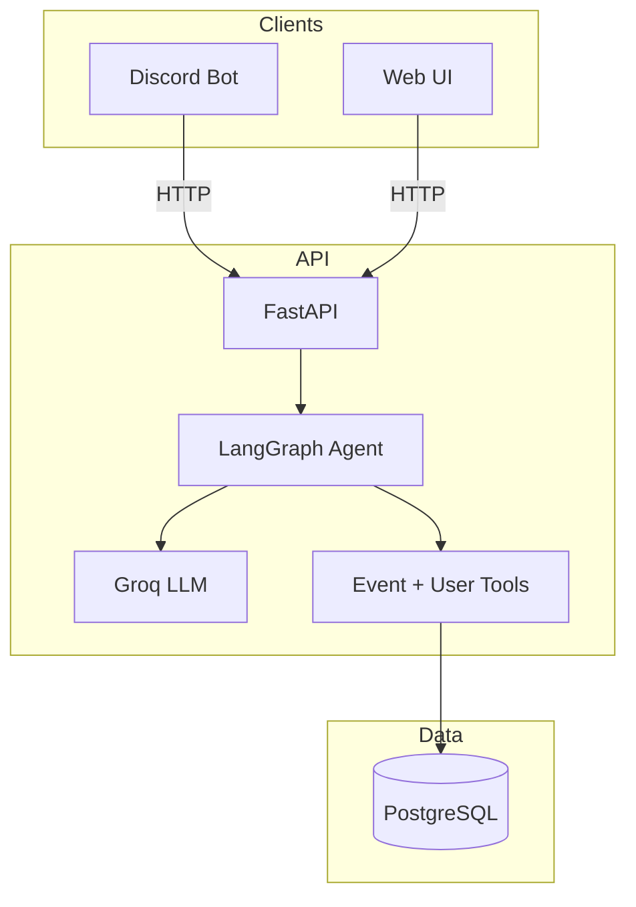

# Game Night Manager 🎲

**🎲 Game night planning, simplified.**

🎮 Your game night buddy catches the vibe in your chat, rallies the crew, and helps turn "that sounds fun" into real plans.

---

## How It Works

Your buddy lives where you already chat. It tunes into the conversation and offers to help set up game nights when it feels natural. No commands. No forms. Just talk.

- **Discord** — Add the bot to your server. It joins your channels, listens in, and when someone mentions wanting to play something or suggests a game night, it's ready to help. Chill and non-pushy; it only chimes in when it adds value.

- **Web** — A standalone chat interface for when you prefer a dedicated UI. Same buddy, same capabilities.

Both use the same backend. Create events, invite people, set dates and locations—all in natural language.

---

## Features

- 🎲 **Vibe-reactive** — Picks up when people are talking about games or wanting to play. Offers to lock in a time when the moment feels right.
- 💬 **Natural language** — "Create a Catan night next Friday at 7pm" or "Invite Alex to the game night"
- 📅 **Event lifecycle** — Planning, confirmed, cancelled. Hosts can update plans; everyone can accept or decline invites.
- 🎧 **Multi-channel Discord** — Joins multiple channels, fetches recent context on each message, stays stateless.
- 🌐 **Web chat** — JWT auth, conversation persistence, same agent.

---

## Architecture



- **Backend**: FastAPI, SQLModel, PostgreSQL, Alembic
- **Agent**: LangGraph, LangChain, Groq LLM
- **Frontend**: React, Vite, React Router
- **Bot**: discord.py, httpx (separate process, calls API over HTTP)

---

## Project Structure

```
api/           # FastAPI app, agents, domains (events, auth, users)
frontend/      # React SPA
bot/discord/   # Discord bot (separate process)
```

---

## Getting Started

### Prerequisites

- Python 3.12+
- Node.js
- PostgreSQL

### Environment Variables

**API & Frontend:**
```
DATABASE_URL=postgresql://...
SECRET_KEY=...
GROQ_API_KEY=...
```

**Discord Bot:**
```
DISCORD_BOT_TOKEN=...
API_BASE_URL=https://your-api.vercel.app
DISCORD_API_KEY=...              # For X-API-Key on /api/agents/channel
```

The bot responds in any channel it can read. No channel IDs to configure—each message includes its channel context.

### Run Locally

1. **Migrations**: `alembic upgrade head`
2. **API**: `fastapi dev api/index.py` (or `uvicorn api.index:app`)
3. **Frontend**: `cd frontend && npm install && npm run dev`
4. **Discord Bot**: `python -m bot.discord.main` (runs separately)

### Deployment

- **Vercel** — API and frontend deploy together. `vercel.json` routes `/api/*` to FastAPI and `/*` to the SPA.
- **Discord Bot** — Runs as a separate process (Railway, Fly.io, or a VPS).

---

## Docs

- [PRODUCT_SPEC.md](PRODUCT_SPEC.md) — Full product specification
- [bot/discord/PLAN.md](bot/discord/PLAN.md) — Discord bot design and implementation plan
